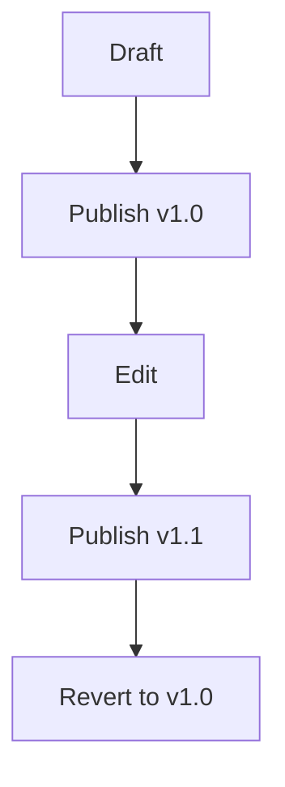

## Overview

Projeto - Lastro Consignado provides powerful tools to streamline your documentation workflow. You organize content into intuitive structures, track changes with version history, collaborate seamlessly with your team, search efficiently across all documents, and export or share pages effortlessly. These features ensure your project documentation stays current and accessible.

<Columns cols={3}>
  <Card title="Document Folders" icon="folder" href="#document-organization">
    Structure your docs hierarchically.
  </Card>
  <Card title="Version Control" icon="git-branch" href="#version-control">
    Track every change with history.
  </Card>
  <Card title="Team Collaboration" icon="users" href="#collaboration-tools">
    Edit and review together.
  </Card>
  <Card title="Search & Indexing" icon="search" href="#search-indexing">
    Find content instantly.
  </Card>
  <Card title="Export Options" icon="download" href="#export-sharing">
    Share in multiple formats.
  </Card>
</Columns>

## Document Organization and Folders

Create folders to group related pages logically, mimicking your project's structure. For example, organize payroll loan docs under `consignado/finance` and user guides under `consignado/guides`.

<Steps>
  <Step title="Create a Folder" icon="folder-plus">
    Navigate to your workspace root. Click the `New Folder` button and name it `consignado-docs`.
  </Step>
  <Step title="Add Pages" icon="file-plus">
    Inside the folder, create pages like `setup.mdx` or `api-reference.mdx`.
  </Step>
  <Step title="Nest Subfolders" icon="folder">
    Right-click a folder to add subfolders, such as `consignado-docs/api` for endpoints.
  </Step>
</Steps>

<Callout kind="tip">
  Use consistent naming like `kebab-case` for folders to improve navigation.
</Callout>

## Version Control for Pages

Every edit creates a new version, allowing you to revert changes or compare diffs. View history via the page menu.



<Expandable title="View Version Diff" default-open="false">
  Select `History` from the page menu. Compare `v1.1` with `v1.0` to spot additions like new API fields.
</Expandable>

## Collaboration Tools for Teams

Invite team members with role-based access: editors, reviewers, or viewers. Real-time editing and comments keep everyone aligned.

<Tabs>
  <Tab title="Editor Role" icon="edit-3">
    Make changes directly. Use `@mentions` to notify colleagues, e.g., `@jane Review this section`.
  </Tab>
  <Tab title="Reviewer Role" icon="eye">
    Add comments without editing. Resolve threads once addressed.
  </Tab>
  <Tab title="Viewer Role" icon="user">
    Read-only access for stakeholders.
  </Tab>
</Tabs>

## Search and Indexing Functions

Full-text search indexes all pages instantly. Query terms like `consignado API` to surface relevant docs.

| Feature | Description |
|---------|-------------|
| Live Search | Results update as you type |
| Filters | By folder, tag, or date |
| Advanced | Boolean operators: `API AND consignado` |

<Callout kind="info">
  Tags like `#finance` or `#security` enhance search precision.
</Callout>

## Export and Sharing Options

Export pages as PDF, HTML, or Markdown. Generate shareable links with optional passwords.

<CodeGroup tabs="Markdown,PDF,HTML">
  ```markdown
  # Consignado Setup
  Install via npm: `npm init @projeto/lastro`
  ```
  ```bash
  # Export command-line
  projeto export page-id --format=pdf output.pdf
  ```
  ```html
  <!-- Shared HTML snippet -->
  <div>Embed: <script src="https://docs.projeto.com/embed/page-id"></script></div>
  ```
</CodeGroup>

Share via public links: `https://docs.projeto.com/lastro/setup?token=share-abc123`.

<Columns cols={2}>
  <Card title="Next: Quickstart" icon="rocket" href="/quickstart">
    Set up your first workspace.
  </Card>
  <Card title="Authentication" icon="shield" href="/authentication">
    Secure team access.
  </Card>
</Columns>